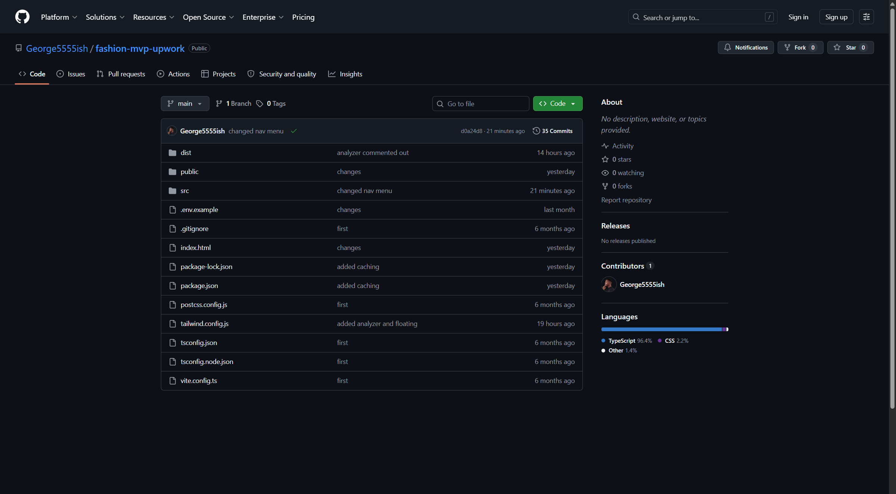
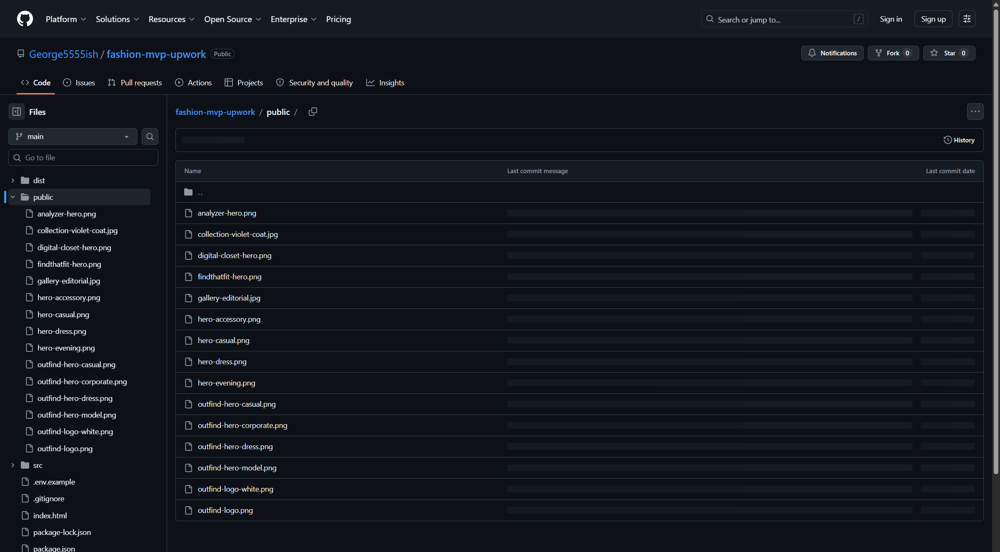
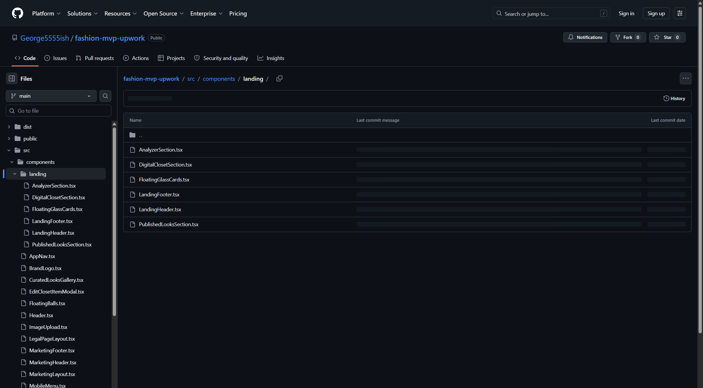
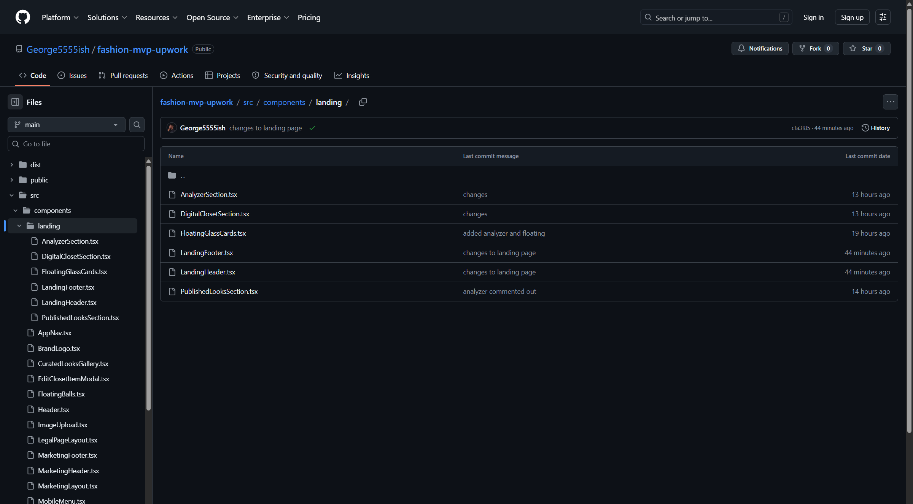

# OutFind — Quick editing guide

**Your repo:** [github.com/George5555ish/fashion-mvp-upwork](https://github.com/George5555ish/fashion-mvp-upwork)

This guide covers the basics: how to get in, and where to go for simple changes like text, colors, and images.

---

## Quick reference — where to change things

| I want to change… | Open this file |
|-------------------|----------------|
| Brown brand color | [tailwind.config.js](https://github.com/George5555ish/fashion-mvp-upwork/blob/main/tailwind.config.js) |
| Green subheadings | [src/index.css](https://github.com/George5555ish/fashion-mvp-upwork/blob/main/src/index.css) |
| Homepage text & hero | [src/pages/HomePage.tsx](https://github.com/George5555ish/fashion-mvp-upwork/blob/main/src/pages/HomePage.tsx) |
| Closet section | [DigitalClosetSection.tsx](https://github.com/George5555ish/fashion-mvp-upwork/blob/main/src/components/landing/DigitalClosetSection.tsx) |
| Analyzer section | [AnalyzerSection.tsx](https://github.com/George5555ish/fashion-mvp-upwork/blob/main/src/components/landing/AnalyzerSection.tsx) |
| Logo | [public/outfind-logo.png](https://github.com/George5555ish/fashion-mvp-upwork/blob/main/public/outfind-logo.png) |
| Menu labels | [src/config/navigation.ts](https://github.com/George5555ish/fashion-mvp-upwork/blob/main/src/config/navigation.ts) |
| Header | [LandingHeader.tsx](https://github.com/George5555ish/fashion-mvp-upwork/blob/main/src/components/landing/LandingHeader.tsx) |
| Footer | [LandingFooter.tsx](https://github.com/George5555ish/fashion-mvp-upwork/blob/main/src/components/landing/LandingFooter.tsx) |
| Mobile nav | [MobileMenu.tsx](https://github.com/George5555ish/fashion-mvp-upwork/blob/main/src/components/MobileMenu.tsx) |

---

## Step 1 — Get set up (one time)

1. **Accept your GitHub invite** from the email, or go to [github.com/notifications](https://github.com/notifications).
2. **Sign in** to GitHub.
3. Open the repo: **[fashion-mvp-upwork](https://github.com/George5555ish/fashion-mvp-upwork)**

You should see folders like `src`, `public`, and a file called `tailwind.config.js`.



---

## Step 2 — How to edit a file

1. Click the file you want (use the table above).
2. Click the **pencil icon** (top-right) to edit.
3. Make your change.
4. Scroll down, write a short note (e.g. `Updated homepage headline`).
5. Click **Commit changes**.



> You must be signed in to edit. Changes save to GitHub but **won’t go live on outfind.fit until your developer deploys** — message them when you’re ready.

---

## Step 3 — Basic changes

### Change text (headlines, paragraphs, button labels)

Open the relevant file from the table above. Look for the words you want to change and edit them directly. For example, in a homepage section you might see:

```tsx
<h2>FindThatFit</h2>
```

Change `FindThatFit` to whatever you want, then commit.

### Change colors

**Brown tones** → edit [tailwind.config.js](https://github.com/George5555ish/fashion-mvp-upwork/blob/main/tailwind.config.js)

Look for `brand` and change the hex codes (e.g. `#8B5E3C`).

**Green subheadings** → edit [src/index.css](https://github.com/George5555ish/fashion-mvp-upwork/blob/main/src/index.css)

Look for `.feature-headline` — that controls the italic green lines under section titles.

### Change images

1. Go to the [`public`](https://github.com/George5555ish/fashion-mvp-upwork/tree/main/public) folder.
2. **Add file → Upload files**, or replace an existing image with the same filename.



| Image file | What it's for |
|------------|---------------|
| `outfind-logo.png` | Leopard logo |
| `hero-casual.png` / `hero-evening.png` | Homepage hero carousel |
| `findthatfit-hero.png` | FindThatFit section |
| `digital-closet-hero.png` | Closet section |
| `analyzer-hero.png` | Analyzer section |

---

## What to avoid

Stick to text, colors, and images. **Ask your developer before changing:**

- Login or account settings
- Anything in `.env` files
- Deleting files or folders
- Re-enabling the Analyzer upload (it’s “Coming soon” for now)

---

## More detail (if you need it)

<details>
<summary><strong>All homepage section files</strong></summary>

| Section | File |
|---------|------|
| FindThatFit | [HomePage.tsx](https://github.com/George5555ish/fashion-mvp-upwork/blob/main/src/pages/HomePage.tsx) |
| Digital Closet | [DigitalClosetSection.tsx](https://github.com/George5555ish/fashion-mvp-upwork/blob/main/src/components/landing/DigitalClosetSection.tsx) |
| Analyzer | [AnalyzerSection.tsx](https://github.com/George5555ish/fashion-mvp-upwork/blob/main/src/components/landing/AnalyzerSection.tsx) |
| Floating cards | [FloatingGlassCards.tsx](https://github.com/George5555ish/fashion-mvp-upwork/blob/main/src/components/landing/FloatingGlassCards.tsx) |



</details>

<details>
<summary><strong>Other pages</strong></summary>

| Page | File |
|------|------|
| FindThatFit | [FindThatFitPage.tsx](https://github.com/George5555ish/fashion-mvp-upwork/blob/main/src/pages/FindThatFitPage.tsx) |
| Closet | [ClosetPage.tsx](https://github.com/George5555ish/fashion-mvp-upwork/blob/main/src/pages/ClosetPage.tsx) |
| Analyzer | [AnalyzePage.tsx](https://github.com/George5555ish/fashion-mvp-upwork/blob/main/src/pages/AnalyzePage.tsx) |
| Contact | [ContactPage.tsx](https://github.com/George5555ish/fashion-mvp-upwork/blob/main/src/pages/ContactPage.tsx) |

</details>

<details>
<summary><strong>Preview changes on your computer (optional)</strong></summary>

1. Install [Node.js](https://nodejs.org/)
2. Download the repo from GitHub
3. In a terminal, run:

```bash
npm install
npm run dev
```

4. Open **http://localhost:3000**

</details>

---

## Need help?

Message your developer to deploy changes or for anything you’re unsure about.

GitHub’s own intro: [docs.github.com](https://docs.github.com/en/get-started/quickstart/hello-world)
